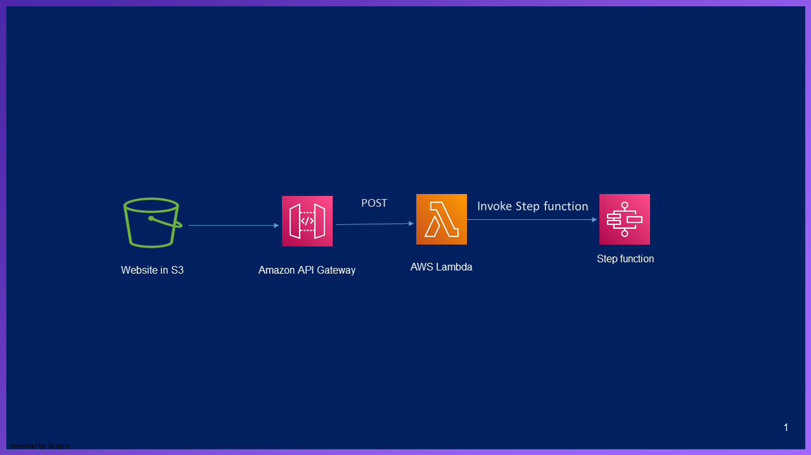
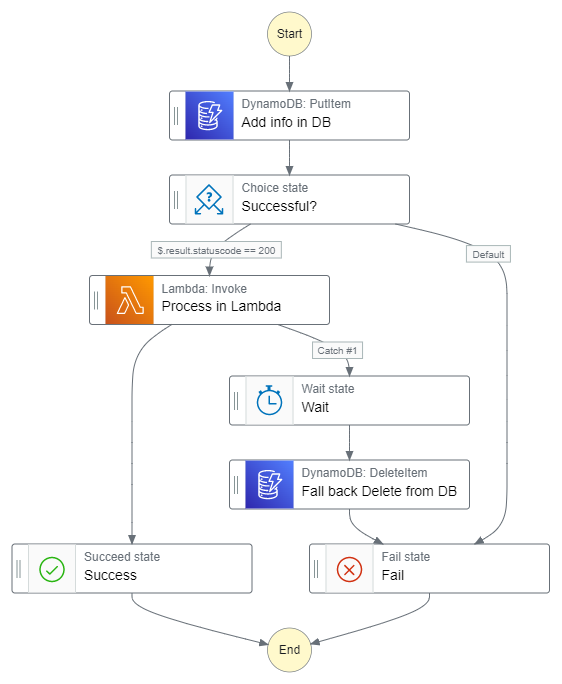

## Highlights

* Explains how to integrate various serverless components using step function.
* Integrates S3 website with Step function

## Architecture
<p align="center">
   
</p>

<p align="center">
   
</p>

## Steps to replicate
  
  1. Setup DynamoDB
  
     **1.1** Create Table "StepFunctionDemo" with below fields with least provisioned capacity
     
	    **i.** customerId as String and as a Partition key
		
	    **ii.** orderId as String and as a Sort key
				
		
  2. Create Lambda functions
  
      **2.1** Create Python Lambda "InvokeStepFunctions" for invoking step function and add "AWSStepFunctionsFullAccess" managed IAM policy and modify line 10
        ```bash
		stateMachineArn='#ARN of statemachine',
				to be replaced to something similar to below
		stateMachineArn='arn:aws:states:us-east-1:9xxxxxxxxxx4:stateMachine:MyStateMachine',			
		```	  
      
      **2.2** Create Python Lambda "StepFunctionDemo"

  3. Create API gateway
  
       **3.1** Create public API and create a POST method with below details.
       
		**i.** Under "Integration Request" redirect requests to "InvokeStepFunctions" lambda which was created
		
		**ii.** Enable CORS 
		
		**iii.** Deploy API under the Deployment stage as "dev"	
		
		
  4. Setup S3 public bucket

       **4.1** Create a public bucket with below bucket policy
	 ```bash
		{
	    "Version": "2012-10-17",
	    "Statement": [
		{
		    "Sid": "PublicRead",
		    "Effect": "Allow",
		    "Principal": "*",
		    "Action": [
			"s3:GetObject",
			"s3:GetObjectVersion"
		    ],
		    "Resource": "arn:aws:s3:::#bucketname#/*"
		}
	    ]
		}
	  ```
	
       **4.2**  Edit "orderDetails.html" and modify the below in line 41 to add API gateway connection url   
        ```bash
		fetch("#API_gateway_Connection_URL#/dev", requestOptions)"
				to be replaced to something similar to below
		fetch("https://50opsp1bk2.execute-api.us-east-1.amazonaws.com/dev", requestOptions)				
		```
	
   
  5. Access the website

      **5.1**  Use "orderDetails.html" to upload user details


  6. Create Step function
  
       **6.1** Create a state machine and paste the contents from "workflow_code.txt".
             

## Youtube references

<!-- YOUTUBE:START -->
- [Setting up Step function](https://www.youtube.com/watch?v=DFSko_sLyMM)
- [Invoke Step function from lambda(https://www.youtube.com/watch?v=kpuqc_7DQZA)
- [Upload details from website](https://www.youtube.com/watch?v=PzNQXYWQQ7c)
<!-- YOUTUBE:END -->


<!-- 1. item1
1. item2
    1. subitem1
    2. subitem2 -->

